# Traversal Tur Sitesi

## Proje Hakkında  
Bu proje portföy amaçlı geliştirilmiş bir dinamik web sitesidir. Müşterilere turlar listelenir ve müşteriler bu turlara kayıt olabilir. Müşterilerin yaptığı tüm işlemler veritabanında kayıt altında tutulur. Ayrıca, sistemde **Member** ve **Admin** olmak üzere iki farklı kullanıcı rolü bulunmaktadır. **Member** kullanıcıları turlara katılabilirken, **Admin** kullanıcıları web sitesinin tasarımını yapabilir, yeni turlar oluşturabilir ve kullanıcılar üzerinde rol atamaları gerçekleştirebilir.

## Özellikler  
- Kullanıcıların turları listeleyip kayıt olabilmesi  
- Admin kullanıcıları yeni turlar oluşturabilir ve mevcut turları düzenleyebilir  
- Admin paneli üzerinden kullanıcı rol yönetimi yapılabilir  
- Kullanıcı ve Admin işlemleri veritabanına kaydedilir  
- Dinamik ve kullanıcı dostu bir arayüz  
- **Member** ve **Admin** rolleriyle farklı yetkilendirme seviyeleri

## Kullanılan Teknolojiler  
- **Backend**: ASP.NET Core, N-tier mimarisi, Repository Pattern, Dependency Injection (DI)  
- **Veritabanı**: MSSQL, Code First yaklaşımı ile veritabanı tasarımı  
- **Frontend**: Bootstrap, Ajax  
- **Veritabanı Yönetimi**: Migration kullanılarak veritabanı işlemleri yapılmıştır

## Roller ve Yetkilendirme  
- **Member**: Kullanıcılar turlara kaydolabilir ve kendilerine ait bilgilerle giriş yapabilir.  
- **Admin**: Admin kullanıcıları, yeni turlar oluşturabilir, mevcut turları düzenleyebilir ve kullanıcılara roller atayabilir. Web sitesinin yönetiminden sorumludurlar.

## Ekran Görüntüleri
### Ana Sayfa Arayüzü
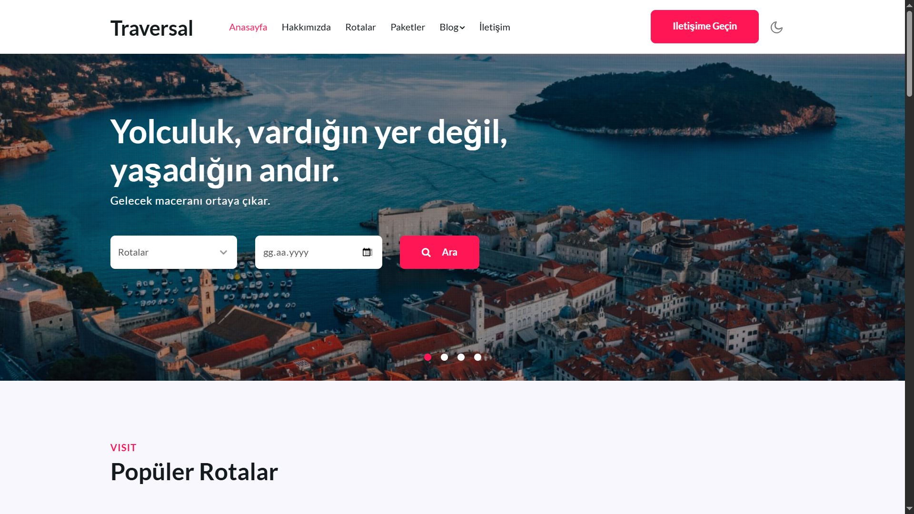

### Ana Sayfa Turlar Listesi
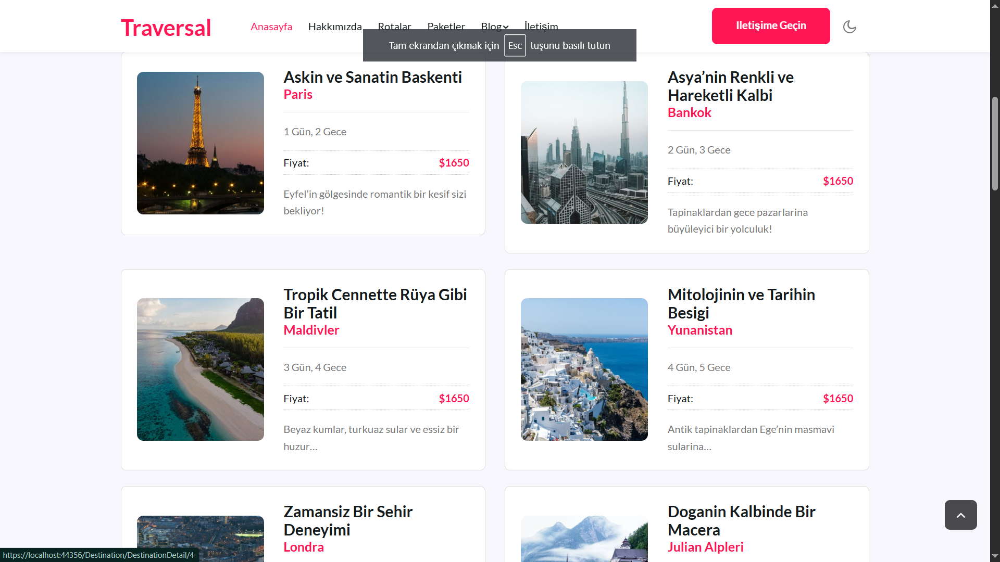

### Login Ekranı
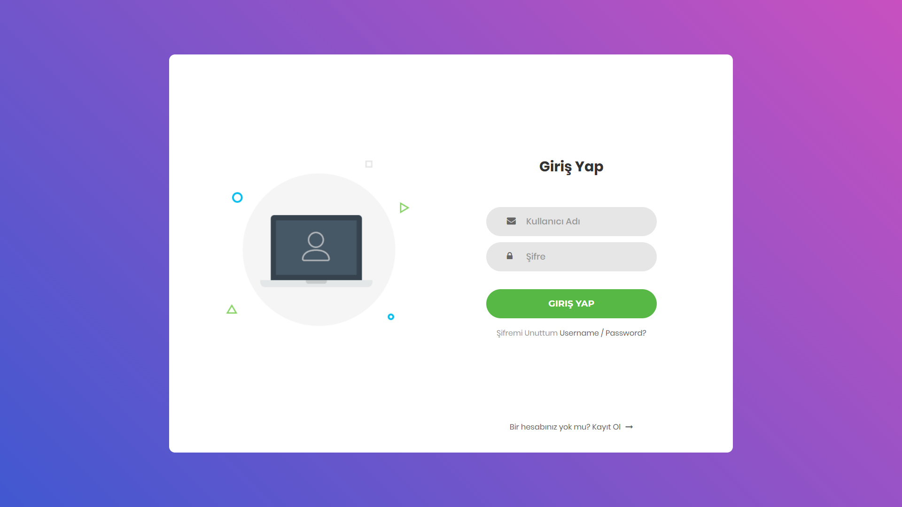

### Register Ekranı
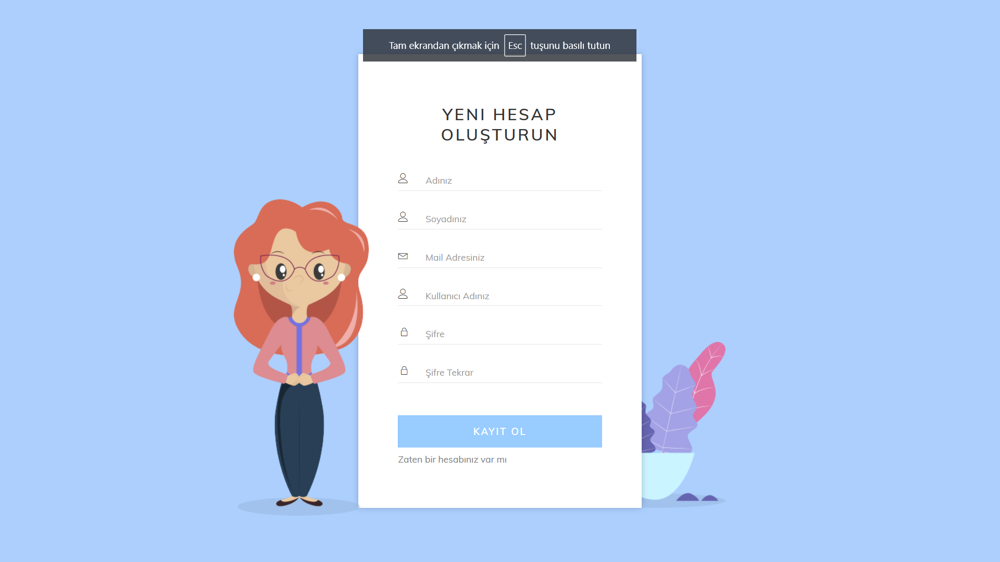

### Member Dashboard
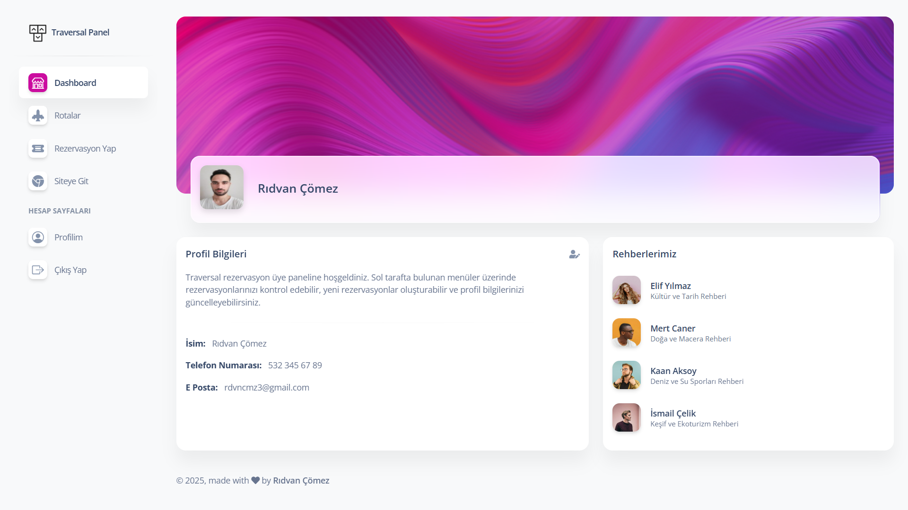

### Member Rezervasyon Sayfası
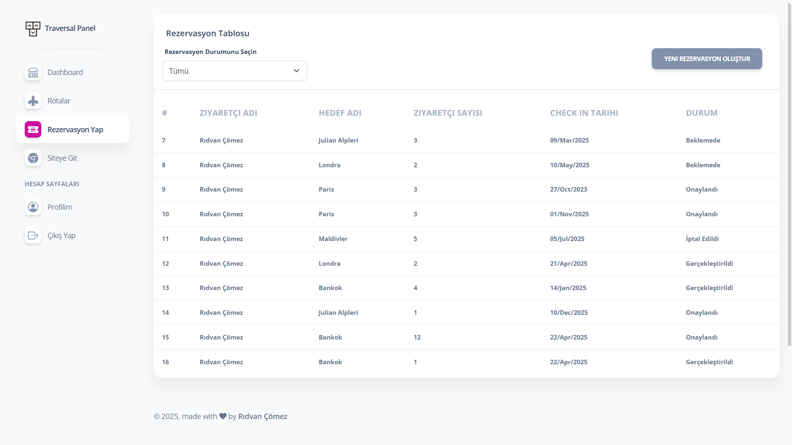

### Admin Dashboard
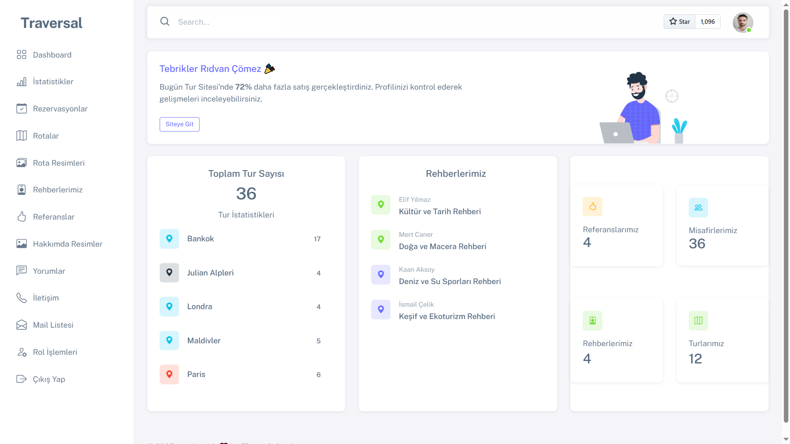

### Admin Rota Sayfası
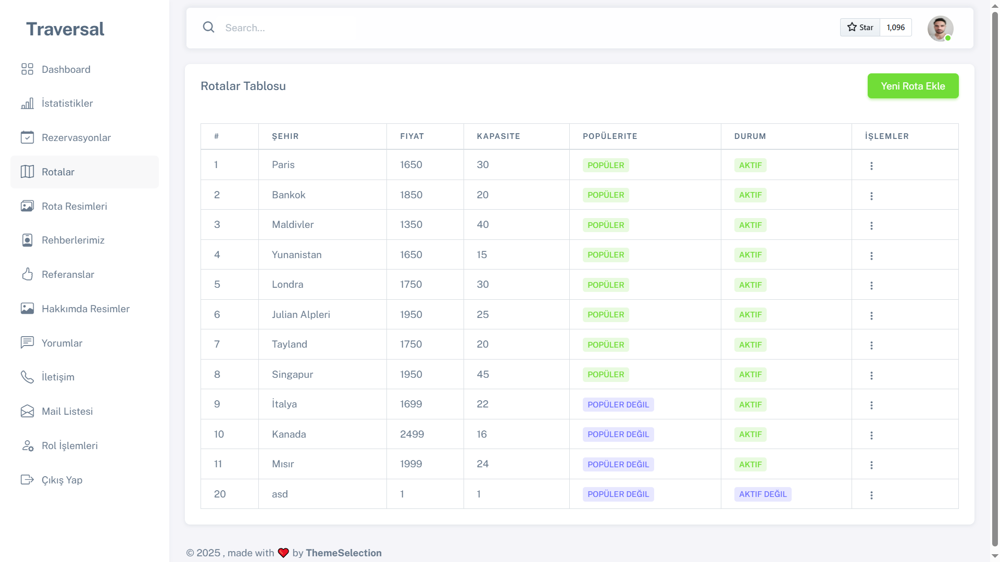

### Admin Rezervasyon Sayfası
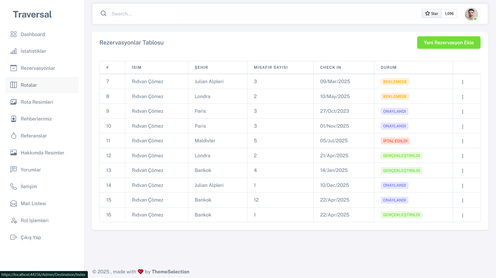

### Admin Rol Sayfası
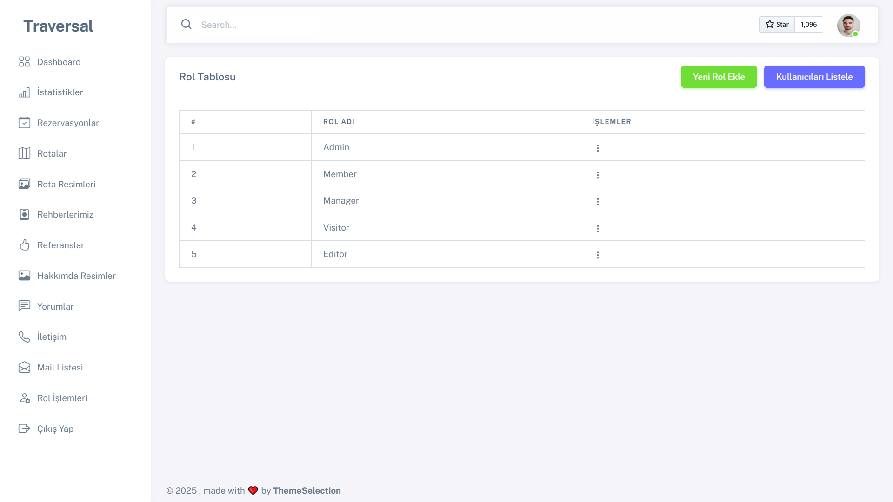

### Admin Rol Atama Sayfası
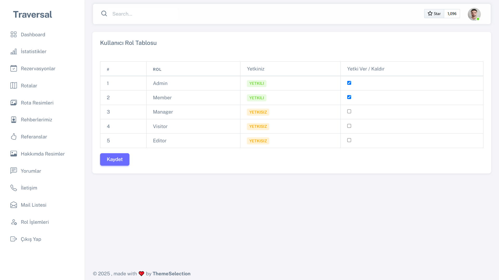

## Kurulum ve Çalıştırma  
1. Projeyi [GitHub Repository] üzerinden indirip bilgisayarınıza çekin.  
2. Veritabanı için migration işlemini gerçekleştirin:  
   ```bash
   dotnet ef database update

   
